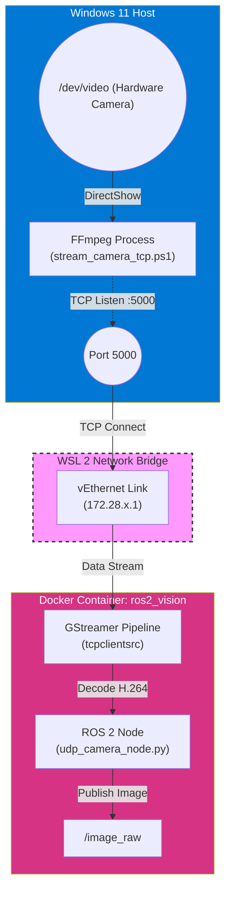

# Guía de Uso: Puente de Video Windows -> ROS 2

Esta guía explica cómo utilizar el sistema de transmisión de video ya configurado en este repositorio.

El objetivo es permitir que un contenedor Docker (corriendo en WSL 2) acceda a la cámara web conectada a Windows, utilizando una conexión de red TCP robusta.

---

## 🛠️ Requisitos Previos e Instalación

Si estás configurando esto desde cero en una máquina nueva, necesitas instalar:

### 1. WSL 2 (Subsistema de Linux)
Si no lo tienes, abre PowerShell como Administrador y ejecuta:
```powershell
wsl --install
```
*(Reinicia tu PC si te lo pide).*

### 2. Docker Desktop
Es el motor que correrá ROS 2.
*   **Descargar**: [https://www.docker.com/products/docker-desktop/](https://www.docker.com/products/docker-desktop/)
*   Durante la instalación, asegúrate de marcar la opción de **WSL 2 backend**.

### 3. FFmpeg (En Windows)
Necesario para capturar la cámara. En PowerShell ejecuta:
```powershell
winget install Gyan.FFmpeg
```

---

## 🚀 Instrucciones de Inicio

Sigue estos 3 pasos cada vez que quieras trabajar con la cámara.

### Paso 1: Configurar la IP (Solo si cambia)

Dado que Windows y WSL son redes distintas, el contenedor necesita saber a qué dirección conectarse.

1.  Abre PowerShell en Windows y ejecuta: `ipconfig`
2.  Busca el adaptador **"vEthernet (WSL)"** y copia su **Dirección IPv4** (ej: `172.28.192.1`).
3.  Abre el archivo `src/udp_camera_node.py` en este repo.
4.  Busca la línea que dice `tcpclientsrc host=...` y pega tu IP ahí.

### Paso 2: Iniciar el Servidor de Video (Windows)

Este script le dice a Windows: "Enciende la cámara y espera que alguien te pida el video".

1.  En PowerShell, ve a la carpeta del proyecto.
2.  Ejecuta:
    ```powershell
    .\stream_camera_tcp.ps1
    ```
3.  **Resultado esperado**: Verás un mensaje "Iniciando SERVIDOR TCP..." y se quedará esperando. **No cierres esta ventana.**

### Paso 3: Iniciar el Receptor ROS 2 (Docker)

Este comando inicia el nodo dentro del contenedor que "llama" a Windows para pedirle el video.

1.  Abre una terminal nueva.
2.  Entra al contenedor con este comando:
    ```powershell
    docker compose exec ros2_vision bash
    ```
3.  (Opcional) Si ROS no carga, ejecuta: `source /opt/ros/humble/setup.bash`
4.  Ejecuta el nodo:
    ```bash
    python3 src/udp_camera_node.py
    ```

Si todo conecta, la ventana de Windows (Paso 2) empezará a mostrar datos de transmisión.

---

## ✅ Verificación

Para confirmar que ROS 2 está recibiendo las imágenes:

1.  Abre otra terminal de PowerShell.
2.  **Entra al contenedor:**
    ```powershell
    docker compose exec ros2_vision bash
    ```
3.  **Ejecuta el verificador:**
    ```bash
    source /opt/ros/humble/setup.bash
    ros2 topic hz /image_raw
    ```
    *Deberías ver una tasa de frames constante (ej. average rate: 15.322).*

---

## 🏗️ Diagrama de Arquitectura

Puedes visualizar el flujo de datos con este digrama (copia este código en un visor Mermaid o GitHub):


